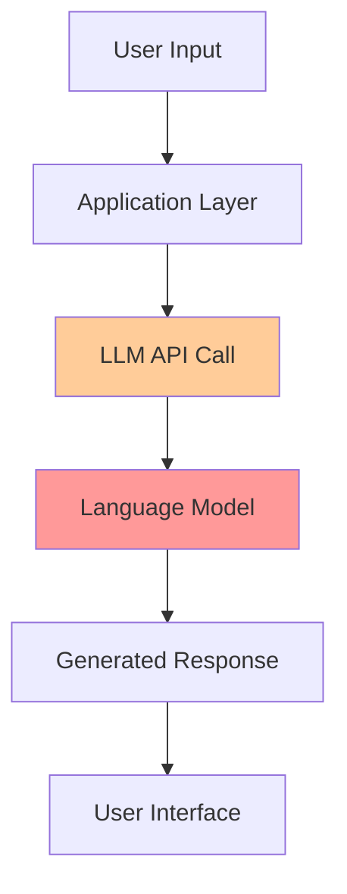
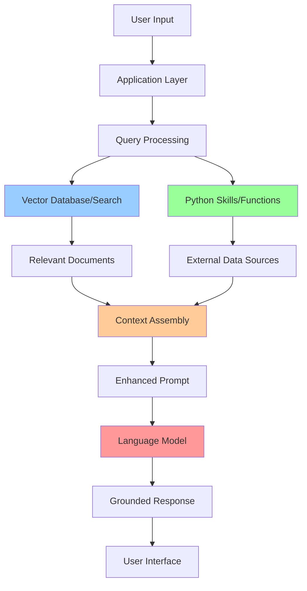
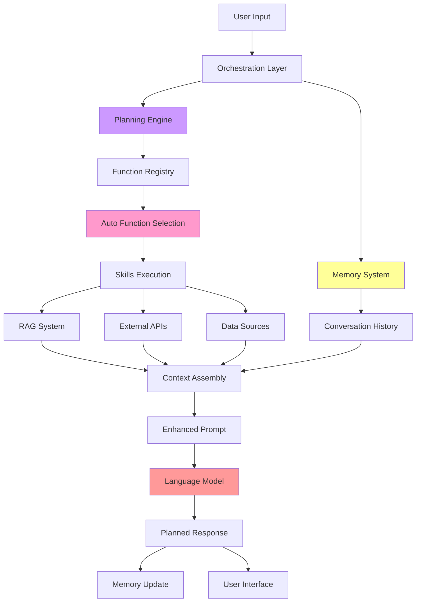
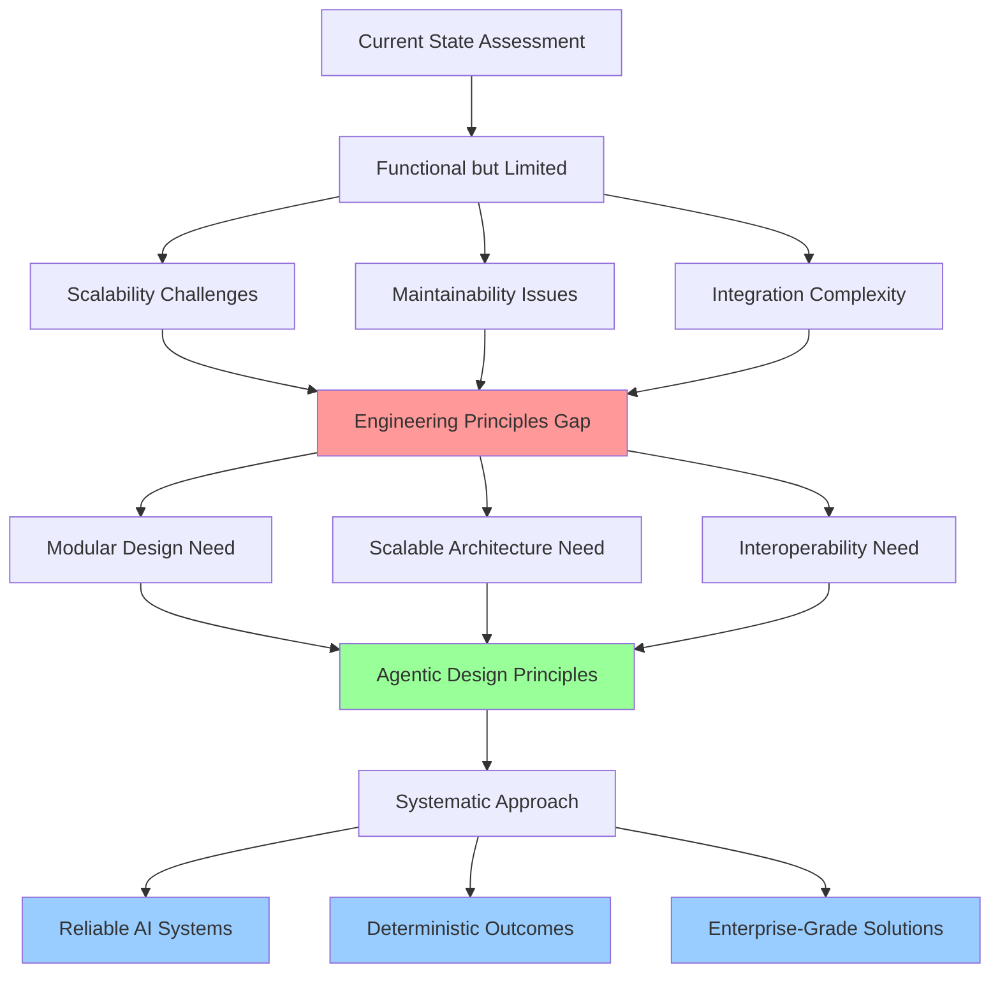
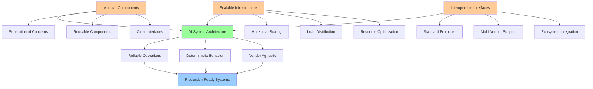
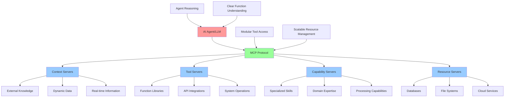
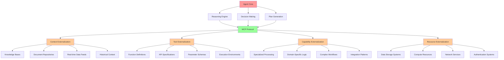

# Evolution of AI Systems: From Direct LLM Calls to Model Context Protocol (MCP)

## Slide 1: Direct LLM Call in Chatbot Experience

**Title: Basic LLM Integration - The Starting Point**

**Key Characteristics:**
- Simple request-response pattern
- Direct API integration with LLM providers
- Limited context awareness
- No external data integration
- Responses based solely on training data
- High risk of hallucination and outdated information

---

## Slide 2: RAG Pattern with Skills and Grounding

**Title: Enhanced Context Through Retrieval-Augmented Generation**

**Key Characteristics:**
- Retrieval-Augmented Generation (RAG) implementation
- Python-based skills for data retrieval
- Context grounding with external data sources
- Vector embeddings for semantic search
- Reduced hallucination through factual grounding
- Dynamic knowledge integration

---

## Slide 3: Orchestration with Memory and Auto-Function Calling

**Title: Intelligent Orchestration and Planning**

**Key Characteristics:**
- LLM-driven planning and decision making
- Automated function calling based on context
- Persistent memory across conversations
- Multi-step reasoning capabilities
- Dynamic workflow orchestration
- Self-directed tool selection

---

## Slide 4: Genesis of Agentic Design Principles

**Title: Recognizing the Need for Engineering Principles**

**Key Characteristics:**
- Recognition of architectural limitations
- Need for software engineering principles
- Focus on **Modular** component design
- Emphasis on **Scalable** system architecture
- Requirements for **Interoperable** solutions
- Transition from functional to systematic approach

---

## Slide 5: Engineering-Focused AI Systems

**Title: Implementing Modular, Scalable, and Interoperable Solutions**

**Key Characteristics:**
- **Modular**: Component-based architecture with clear separation
- **Scalable**: Horizontal scaling capabilities and resource optimization
- **Interoperable**: Standard protocols and vendor-agnostic interfaces
- Reliable, deterministic AI solutions
- Enterprise-grade system design
- Foundation for the next evolution: MCP

---

## Slide 6: Model Context Protocol (MCP) - The Next Evolution

**Title: Decoupled AI Architecture Through MCP**

**Key Characteristics:**
- **Decoupled Architecture**: Clear separation between agents and external systems
- **Standardized Communication**: MCP protocol for consistent interactions
- **Agent Clarity**: LLMs understand available functions and capabilities
- **Modular Integration**: Independent server components
- **Scalable Deployment**: Distributed server architecture
- **Vendor Interoperability**: Standard protocol across providers

---

## Slide 7: MCP Core Externalization Principles

**Title: What MCP Externalizes for Cleaner Agent Reasoning**

**MCP Externalization Benefits:**

### **Context Externalization**
- Removes knowledge management burden from agents
- Enables dynamic, up-to-date information access
- Supports multiple context sources simultaneously
- Maintains context consistency across agent interactions

### **Tool Externalization** 
- Provides clear function interfaces and specifications
- Enables discovery of available capabilities
- Supports parameter validation and type safety
- Allows independent tool development and deployment

### **Capability Externalization**
- Separates complex domain logic from core reasoning
- Enables specialized processing without agent complexity
- Supports capability composition and reuse
- Facilitates expert system integration

### **Resource Externalization**
- Abstracts infrastructure complexity from agents
- Provides secure, managed access to external systems
- Enables resource pooling and optimization
- Supports enterprise security and compliance requirements

---

## Summary: Engineering Evolution

This evolution represents a fundamental shift from monolithic, tightly-coupled AI implementations to distributed, modular architectures that embody core software engineering principles. MCP represents the culmination of this evolution, providing the protocol layer necessary for building reliable, scalable, and interoperable AI systems suitable for enterprise deployment.

The progression demonstrates how the AI development community has learned to apply established software engineering practices to create maintainable, extensible AI solutions that can operate at scale while maintaining deterministic behavior and multi-vendor compatibility.