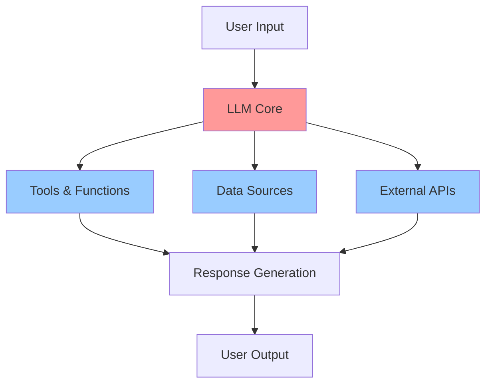
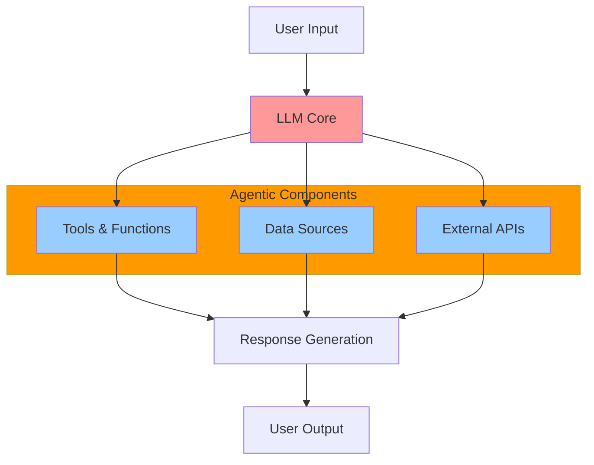
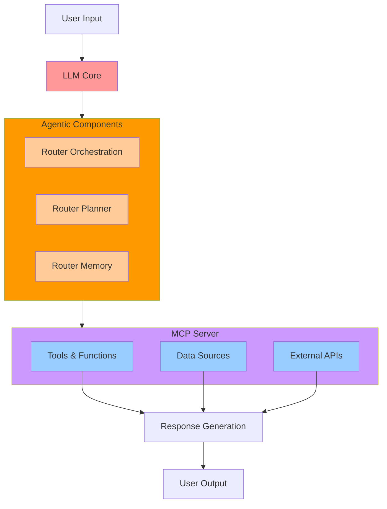

# Evolution of AI Systems: From Direct LLM Calls to Model Context Protocol (MCP)

## Slide 1: Direct LLM Call in Chatbot Experience

**Title: Basic LLM Integration - The Starting Point**

**Key Characteristics:**
- Simple request-response pattern
- Direct API integration with LLM providers
- Limited context awareness
- No external data integration
- Responses based solely on training data
- High risk of hallucination and outdated information

---

## Slide 2: RAG Pattern with Skills and Grounding

**Title: Enhanced Context Through Retrieval-Augmented Generation**

**Key Characteristics:**
- Retrieval-Augmented Generation (RAG) implementation
- Python-based skills for data retrieval
- Context grounding with external data sources
- Vector embeddings for semantic search
- Reduced hallucination through factual grounding
- Dynamic knowledge integration

---

## Slide 3: Orchestration with Memory and Auto-Function Calling

**Title: Intelligent Orchestration and Planning**

**Key Characteristics:**
- LLM-driven planning and decision making
- Automated function calling based on context
- Persistent memory across conversations
- Multi-step reasoning capabilities
- Dynamic workflow orchestration
- Self-directed tool selection

---

## Slide 4: Genesis of Agentic Design Principles

**Title: Recognizing the Need for Engineering Principles**

**Key Characteristics:**
- Recognition of architectural limitations
- Need for software engineering principles
- Focus on **Modular** component design
- Emphasis on **Scalable** system architecture
- Requirements for **Interoperable** solutions
- Transition from functional to systematic approach

---

## Slide 5: Base AI System Architecture

**Title: Foundation Layer - Core AI Components**

**Key Characteristics:**
- Basic AI system components
- Direct connections between LLM and resources
- Tightly coupled architecture
- Foundation for applying engineering principles

---

## Slide 6: Adding Agentic Principles Layer

**Title: Foundation + Agentic Design Principles**

**Key Characteristics:**
- Same foundation with agentic component grouping
- **Modular**: Components organized within agentic boundary
- **Scalable**: Clear separation between core LLM and external systems
- **Interoperable**: Grouped components enable standard interfaces
- Systematic approach to AI system design

---

## Slide 7: Adding MCP Protocol Layer

**Title: Foundation + Agentic Principles + MCP**

**Key Characteristics:**
- **MCP Server**: Protocol-based external system management
- **Agentic Components**: Router-based orchestration, planning, and memory
- **Router Orchestration**: Manages workflow coordination
- **Router Planner**: Handles strategic decision making
- **Router Memory**: Maintains context and state
- Complete separation between agent reasoning and external resources

---

## Summary: Engineering Evolution

This evolution represents a fundamental shift from monolithic, tightly-coupled AI implementations to distributed, modular architectures that embody core software engineering principles. MCP represents the culmination of this evolution, providing the protocol layer necessary for building reliable, scalable, and interoperable AI systems suitable for enterprise deployment.

The progression demonstrates how the AI development community has learned to apply established software engineering practices to create maintainable, extensible AI solutions that can operate at scale while maintaining deterministic behavior and multi-vendor compatibility.